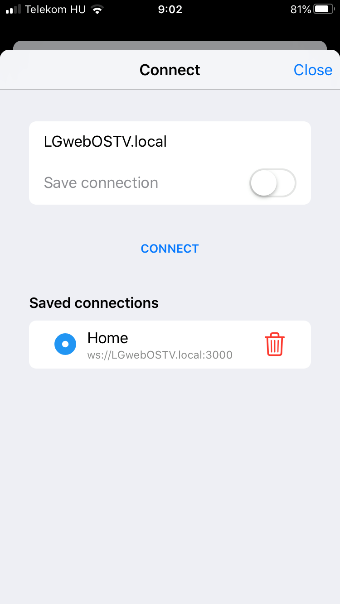
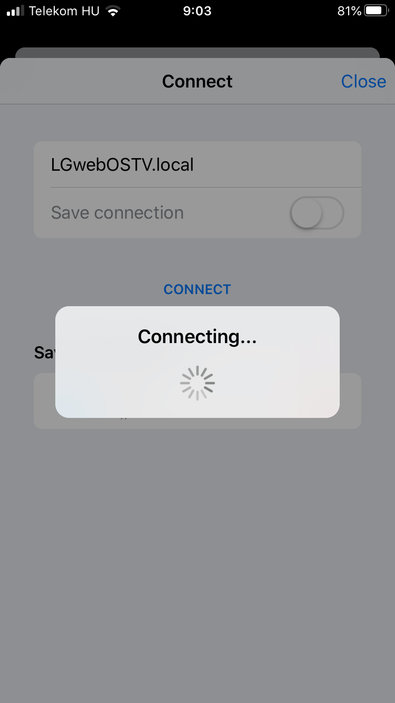
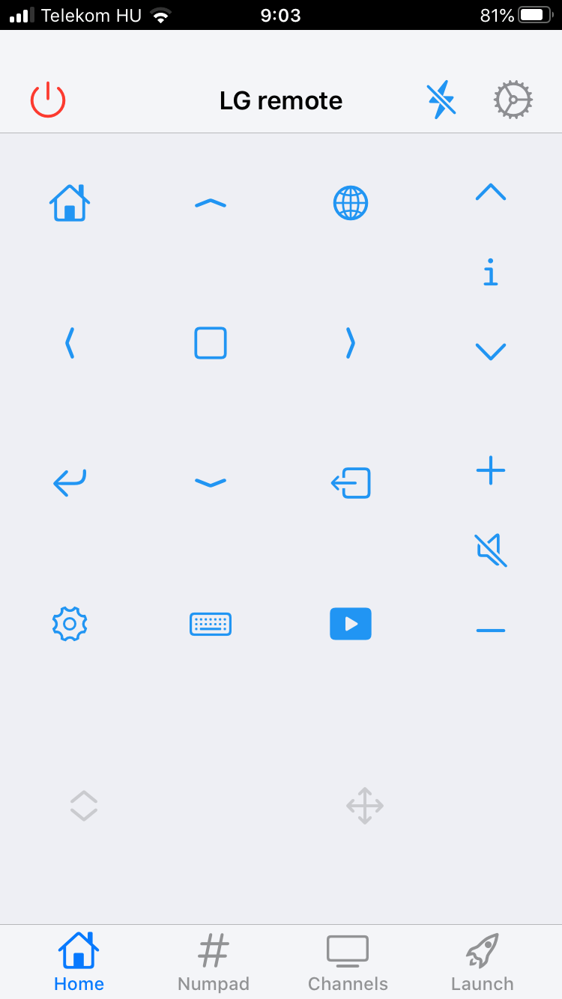
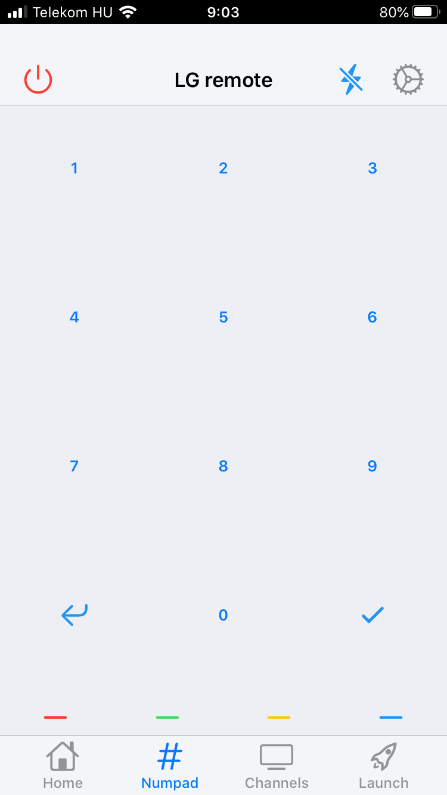
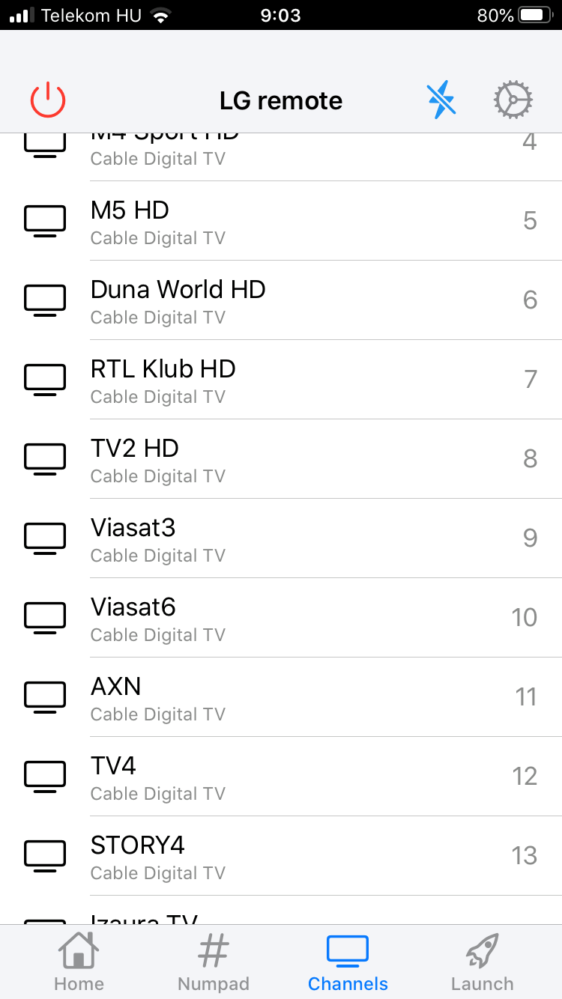
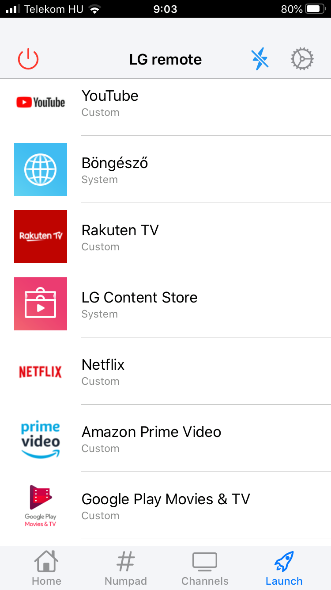
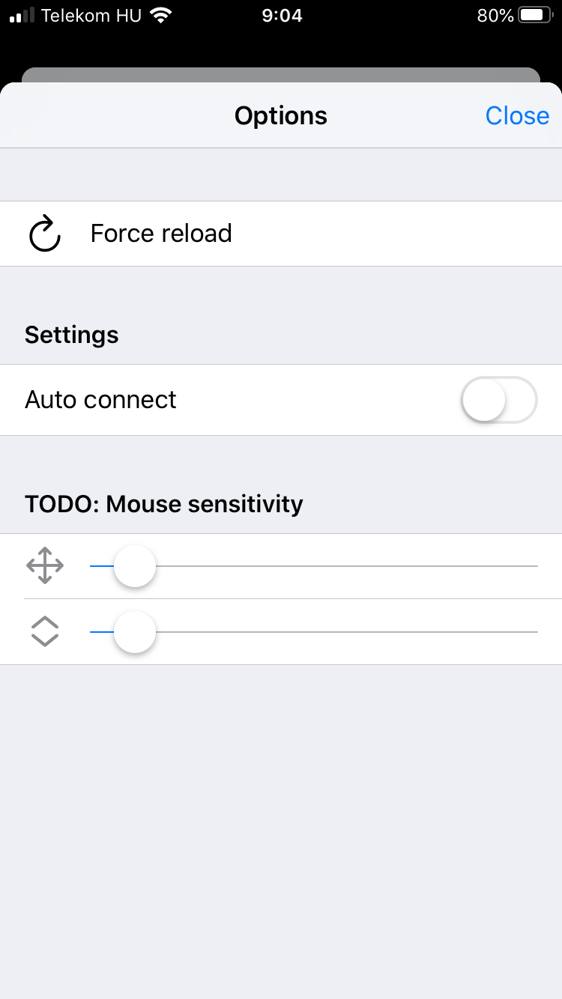

# tv-remote

Remote control API and webapp for LG WebOS TV

## API

> in `/core` folder

An example for the usage is in `/svelte-mobile/src/remote-controller.js`

## Mobile PWA (svelte)

> in `/svelte-mobile` folder

### Screenshots  

